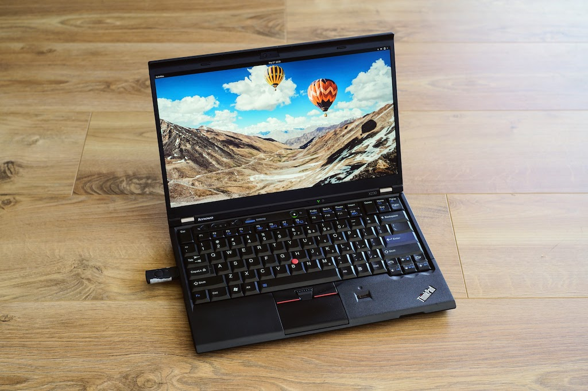
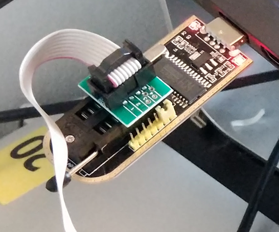
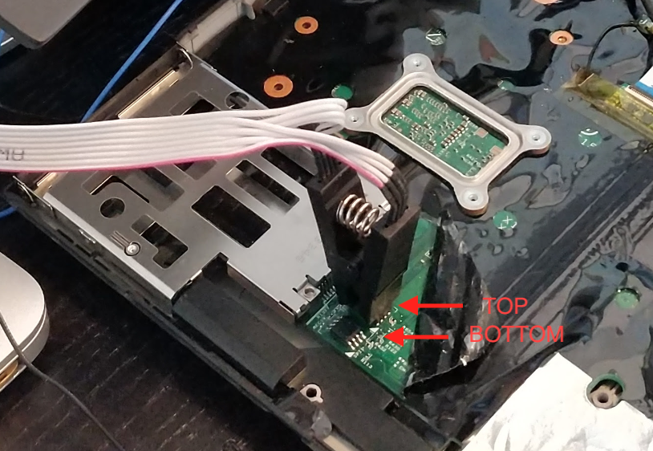

# Lenovo X230 FHD patched coreboot

Instructions on how to patch and flash Coreboot onto a Nitrocaster FHD modded Lenovo X230

This will make any OS support the FHD modded display as it's primary, native display. This eliminates the need to run duplicate displays in the OS, or custom patching the linux kernel.



**Read before you proceed:**

1. Refer to the [official coreboot instructions](https://doc.coreboot.org/tutorial/part1.html) in case these instructions become outdated
2. For all commands below, `$` means run as user, and `#` means run with root permissions (i.e., `sudo <command>`)

## Build Coreboot

### Install dependencies

Ubuntu, Debian, etc. 

```
# apt-get install -y bison build-essential curl flex git gnat libncurses5-dev m4 zlib1g-dev
```
Arch, Manjaro, etc.

```
# pacman -S base-devel curl git gcc-ada ncurses zlib
```
Fedora, Redhat, etc.

```
# dnf install git make gcc-gnat flex bison xz bzip2 gcc g++ ncurses-devel wget zlib-devel
```

### Checkout coreboot with FHD patch

```
$ git clone https://review.coreboot.org/coreboot.git
$ cd coreboot
```

Navigate to the x230 FHD variant merge request.
Click "Download", and copy the commands under "Checkout". It should look something like this:

```
$ git fetch "https://review.coreboot.org/coreboot" refs/changes/50/28950/10 && $ git checkout FETCH_HEAD
```

You should now see something like this:

```
HEAD is now at 488a875a6a lenovo/x230: introduce FHD variant
```

### Prepare for build process
```
$ git submodule update --init --checkout
```

build coreboot crosscompiler environment (may take a while)

```
$ make crossgcc-i386 CPUS=$(nproc)
```

Make new file `configs/defconfig` and paste the following:

```
CONFIG_USE_OPTION_TABLE=y
CONFIG_TIMESTAMPS_ON_CONSOLE=y
CONFIG_USE_BLOBS=y
CONFIG_VENDOR_LENOVO=y
CONFIG_CBFS_SIZE=0x400000
CONFIG_BOARD_LENOVO_X230_FHD=y
CONFIG_DRIVERS_PS2_KEYBOARD=y
CONFIG_PCIEXP_L1_SUB_STATE=y
CONFIG_PCIEXP_CLK_PM=y
CONFIG_SEABIOS_PS2_TIMEOUT=2000
CONFIG_H8_SUPPORT_BT_ON_WIFI=y
CONFIG_MAINBOARD_USE_LIBGFXINIT=y
CONFIG_GENERIC_LINEAR_FRAMEBUFFER=y

## Uncomment the following to display a bootsplash image
## Follow guide below to make image:
## https://notthebe.ee/2018/09/27/seabios/
# CONFIG_BOOTSPLASH_IMAGE=y
# CONFIG_BOOTSPLASH_FILE=bootsplash.jpg
# CONFIG_BOOTSPLASH=y
# CONFIG_FRAMEBUFFER_SET_VESA_MODE=y

## Optional options
# CONFIG_NO_POST=y
# CONFIG_S3_VGA_ROM_RUN is not set
# CONFIG_H8_BEEP_ON_DEATH is not set
# CONFIG_VGA_ROM_RUN=y
# CONFIG_PCI_OPTION_ROM_RUN_YABEL=y
# CONFIG_VBE_LINEAR_FRAMEBUFFER=y
# CONFIG_DEFAULT_CONSOLE_LOGLEVEL_8=y
# CONFIG_COREINFO_SECONDARY_PAYLOAD=y
# CONFIG_NVRAMCUI_SECONDARY_PAYLOAD=y
# CONFIG_SEABIOS_MASTER=y
# CONFIG_MEMTEST_SECONDARY_PAYLOAD=y
# CONFIG_TINT_SECONDARY_PAYLOAD=y
```


create new .config with the parameters from the defconfig you just created
```
$ make defconfig
```

(Optional) take a look at the created configuration
```
$ make menuconfig
```
 
### Build coreboot image
```
$ make
```

Congratulations! If successful, you should now have a `build` directory in your `coreboot` project directory containing your new `coreboot.img` boot image.

## Flashing the coreboot image

### Prepare a workspace directory
```
$ mkdir build/x230_fhd
$ cd build/x230_fhd
```

### Flashing Coreboot

I used a USB chip programmer similar to [this one](https://www.amazon.com/Coomatec-Socket-Adapter-Programmer-Software/dp/B08KG7YM45/).

Refer to the image below for setup. Notice that Pin 1 is marked by the RED wire.



Connect the flashing tool to the top 4M chip. Note that Pin 1 (the RED wire) is aligned with the WHITE triangle on the X230 motherboard.



Create a backup of the top 4M chip

```
# flashrom -p ch341a_spi -c "MX25L3206E/MX25L3208E" -r top_bak_0.rom
# flashrom -p ch341a_spi -c "MX25L3206E/MX25L3208E" -r top_bak_1.rom
$ md5sum top_bak* # md5sums should match
```

Create the flashable coreboot rom file specifically for the top 4M chip

```
$ dd of=coreboot_top.rom bs=1M skip=8 if=../coreboot.rom
# flashrom -p ch341a_spi -c "MX25L3206E/MX25L3208E" -w coreboot_top.rom
```

### Enable internal flashing

Create a backup of the bottom 8M chip*

**Note: On some models, the chip may have a different identifier "EN25QH64":** \
If you get a chip read error with the identifiers below, subsitute "MX25L6406E/MX25L6408E" for "EN25QH64"

```
# flashrom -p ch341a_spi -c "MX25L6406E/MX25L6408E" -r bottom_bak_0.rom
# flashrom -p ch341a_spi -c "MX25L6406E/MX25L6408E" -r bottom_bak_1.rom
$ md5sum bottom_bak* # md5sums should match
```

Now use the `ifdtool` tool to create an unlocked rom of the bottom 8M chip

```
$ cd ../util/ifdtool
$ ../../util/ifdtool/ifdtool -u bottom_bak_0.rom -O bottom_unlocked.rom
```

You should now have 

Flash bottom 8M chip

**Note: On some models, the chip may have a different identifier "EN25QH64":** \
If you get a chip read error with the identifiers below, subsitute "MX25L6406E/MX25L6408E" for "EN25QH64"

```
# flashrom -p ch341a_spi -c "MX25L6406E/MX25L6408E" -w bottom_unlocked.rom
```

## Congratulations!

You should now have a coreboot'ed Lenovo X230 with native FHD screen support.

## Troubleshooting

If you encounter any errors, please refer to the following resources:
- http://blog.muc.ccc.de/x230modding:start
- https://www.reddit.com/r/coreboot/comments/5oiqiy/x230_internal_flashing/

If you're still stuck and want help, you may find help in the following communities
- https://forum.thinkpads.com/viewtopic.php?t=122640
- https://reddit.com/r/thinkpads/

Or reach out to me on Twitter:
- https://twitter.com/brooksilg